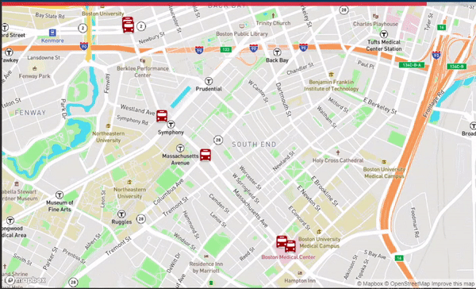

# Real Time Bus Tracker

This app was developed as part of the requirement for week 9 of MIT xPro Web Development With JavaScript course.

Live demo: [https://real-time-bus-tracker.netlify.app](https://real-time-bus-tracker.netlify.app)



## Description

The project displays a map of MIT and Harvard with realtime live data of bus routes between the two schools. The
real-time position of the busses are updated every 15 seconds. A red bar at the top of the page animates every 15
seconds indicating the next refresh cycle of the bus updates.

The project uses 2 external resources:

1. The mapping library from Mapbox
2. The API to get real-time bus data provided by Massachusetts BayTransportation Authority

Other than the mapping library, the project has been coded from scratch using pure JavaScript, HTML and CSS.

## How to Run

### API Key From Mapbox

You will need an API from Mapbox. Please visit https://www.mapbox.com/ and subscribe for free. Once you get your
developer account, please create an API key.

### token.js

Clone or download the project then create a file called ```token.js``` in the ./src directory of the project.

Set the content of the file to:

```javascript
mapboxgl.accessToken = 'USE-YOUR-MAPBOX-API-KEY'
```

### Drag and Drop or Web Server

You can drag the index.html file under the ./src folder into your browser of choice, Chrome, Firefox, Opera, Safari.

Ideally it's best if you can run via a web server. Here are some options:

1. If you use Visual Studio Code, you can install the Live Server
   plugin https://marketplace.visualstudio.com/items?itemName=ritwickdey.LiveServer
2. Use Browser Sync https://browsersync.io/ Install it via npm
3. User http-server https://www.npmjs.com/package/http-server, install it via npm

Then run the server inside the ./src folder.

## Features

- Provides real-time bus data and location
- Refreshes every 15 seconds with updated bus data
- Uses customized markers
- Clicking on the bus markers show bus ID and occupancy data
- Uses a progress bar that reaches 100% every 15 seconds to show when the next update is imminent

## Roadmap of Future Improvements

Some ideas for future improvements include:

- ability to specify a map location
- feature to choose different kinds of public transport aside from busses, like train

What additional features or functionality would be helpful to a user?

## License

**MIT License**

Copyright (c) 2021 Sanjib Ahmad

Permission is hereby granted, free of charge, to any person obtaining a copy of this software and associated
documentation files (the "Software"), to deal in the Software without restriction, including without limitation the
rights to use, copy, modify, merge, publish, distribute, sublicense, and/or sell copies of the Software, and to permit
persons to whom the Software is furnished to do so, subject to the following conditions:

The above copyright notice and this permission notice shall be included in all copies or substantial portions of the
Software.

THE SOFTWARE IS PROVIDED "AS IS", WITHOUT WARRANTY OF ANY KIND, EXPRESS OR IMPLIED, INCLUDING BUT NOT LIMITED TO THE
WARRANTIES OF MERCHANTABILITY, FITNESS FOR A PARTICULAR PURPOSE AND NONINFRINGEMENT. IN NO EVENT SHALL THE AUTHORS OR
COPYRIGHT HOLDERS BE LIABLE FOR ANY CLAIM, DAMAGES OR OTHER LIABILITY, WHETHER IN AN ACTION OF CONTRACT, TORT OR
OTHERWISE, ARISING FROM, OUT OF OR IN CONNECTION WITH THE SOFTWARE OR THE USE OR OTHER DEALINGS IN THE SOFTWARE.